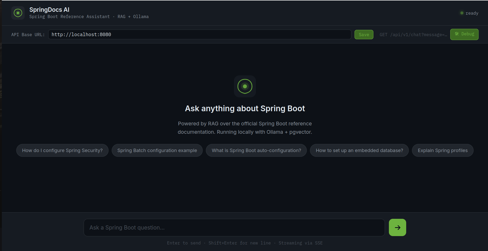
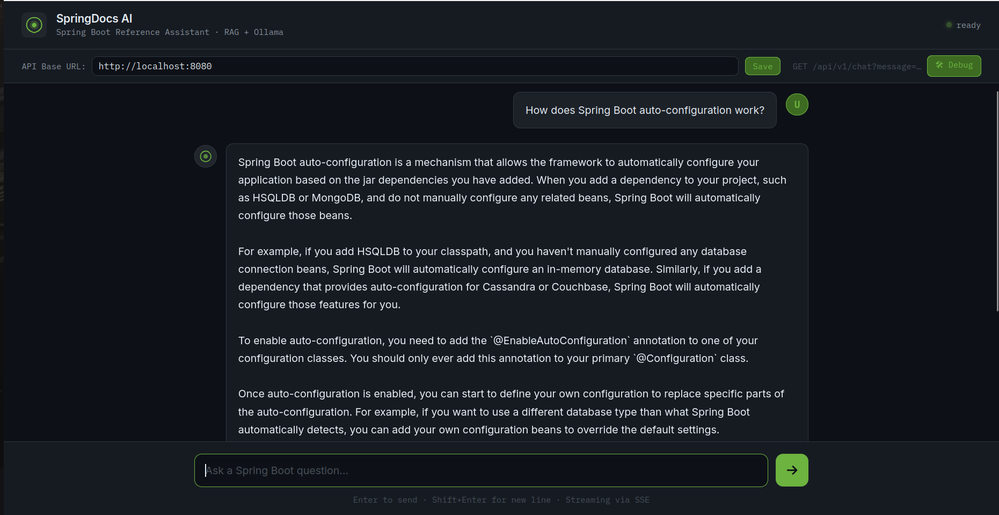

# 🤖 SpringRAG Assistant

An **AI-Powered Spring Documentation Assistant** built with Spring Boot and Spring AI that answers Spring Boot–related questions by streaming responses in real time. It uses **Ollama** for local LLM inference, **pgvector** (PostgreSQL) as the vector store, and the official **Spring Boot Reference Documentation** as its knowledge base.

---

## 🎬 Demo

### Live Streaming Response
<video src="assets/demo.webm" controls width="100%"></video>

> **Note:** If the video doesn't play inline, download it from [`assets/demo.webm`](assets/demo.webm).

### Screenshots

<table>
  <tr>
    <td align="center"><b>Welcome Screen</b></td>
    <td align="center"><b>Streaming Answer</b></td>
  </tr>
  <tr>
    <td></td>
    <td></td>
  </tr>
</table>

> 💡 **To add these assets to your repo**, create an `assets/` folder and drop in the files renamed as:
> ```
> assets/
> ├── demo.webm
> ├── screenshot-home.png
> └── screenshot-response.png
> ```
> Then commit and push — GitHub renders both `<video>` tags and `` tags natively in READMEs.

---

## ✨ Features

- 🔍 **RAG Pipeline** — Ingests the Spring Boot reference PDF, chunks it, embeds it, and stores vectors in PostgreSQL via pgvector
- ⚡ **Streaming Responses** — Responses are streamed token-by-token using Spring WebMVC + Reactor `Flux<String>`
- 🧠 **Local LLM** — Runs entirely on-device with [Ollama](https://ollama.com/) (no OpenAI key required)
- 📄 **PDF Knowledge Base** — Spring Boot reference documentation is automatically loaded into the vector store on first startup
- 🔗 **Similarity Search** — Top-K cosine similarity search retrieves the most relevant document chunks per query
- 💬 **Custom Prompt Template** — Structured StringTemplate prompt with explicit identity, Markdown formatting instructions, hallucination guardrails, and a standard fallback for out-of-scope questions
- 🔒 **Env-based Secrets** — Credentials are configured via environment variables, not hardcoded

---

## 🏗️ Architecture

```
User Query (HTTP GET)
       │
       ▼
ChatController
       │
       ├── VectorStore.similaritySearch(query, topK=2)
       │         │
       │         └── pgvector (PostgreSQL) ◄── RagChatService (loads PDF on startup)
       │
       ├── PromptTemplate (spring_assistant_prompt.st)
       │         └── Injects {input} + {documents}
       │
       └── ChatClient (Ollama / llama3.2)
                 └── stream().content() ──► Flux<String> (SSE)
```

---

## 🛠️ Tech Stack

| Layer | Technology |
|---|---|
| Framework | Spring Boot 4.1.0 |
| AI Orchestration | Spring AI 2.0.0 |
| LLM | Ollama (`llama3.2`) |
| Embeddings | Ollama (`nomic-embed-text`) |
| Vector Store | pgvector (PostgreSQL) |
| Document Reader | Spring AI PDF Document Reader |
| Reactive Streaming | Project Reactor (`Flux`) |
| Boilerplate Reduction | Lombok |
| Build Tool | Maven |
| Java Version | Java 21 |

---

## 📋 Prerequisites

Before running the application, ensure you have the following installed:

- **Java 21+**
- **Maven 3.8+**
- **PostgreSQL** with the `pgvector` extension enabled
- **Ollama** with the required models pulled

### Pull Ollama Models

```bash
ollama pull llama3.2
ollama pull nomic-embed-text
```

### Set Up PostgreSQL with pgvector

```sql
-- Connect to your PostgreSQL instance and run:
CREATE EXTENSION IF NOT EXISTS vector;
CREATE EXTENSION IF NOT EXISTS hstore;
CREATE EXTENSION IF NOT EXISTS "uuid-ossp";

CREATE TABLE IF NOT EXISTS vector.spring_docs_vector_store (
    id uuid DEFAULT uuid_generate_v4() PRIMARY KEY,
    content text,
    metadata json,
    embedding vector(768)
);

CREATE INDEX ON vector.spring_docs_vector_store USING HNSW (embedding vector_cosine_ops);
```

> **Note:** The application is also configured with `spring.ai.vectorstore.pgvector.initialize-schema=true`, which can auto-create the table on startup.

---

## ⚙️ Configuration

The application uses environment variables for sensitive values. Set the following before running:

```bash
export OLLAMA_BASE_URL=http://localhost:11434   # optional, defaults to localhost
export POSTGRES_USER_NAME=your_db_user
export POSTGRES_PASSWORD=your_db_password
```

The full `application.properties` reference:

```properties
# Ollama Settings
spring.ai.ollama.base-url=${OLLAMA_BASE_URL:http://localhost:11434}
spring.ai.ollama.chat.model=llama3.2
spring.ai.ollama.embedding.model=nomic-embed-text

# pgvector Settings
spring.ai.vectorstore.pgvector.index-type=HNSW
spring.ai.vectorstore.pgvector.initialize-schema=true
spring.ai.vectorstore.pgvector.schema-name=vector
spring.ai.vectorstore.pgvector.table-name=spring_docs_vector_store

# PostgreSQL DataSource
spring.datasource.url=jdbc:postgresql://localhost:5432/postgres
spring.datasource.username=${POSTGRES_USER_NAME}
spring.datasource.password=${POSTGRES_PASSWORD}
```

---

## 🚀 Getting Started

### 1. Clone the repository

```bash
git clone https://github.com/your-username/springdocs-ai.git
cd springdocs-ai
```

### 2. Set environment variables

```bash
export POSTGRES_USER_NAME=your_db_user
export POSTGRES_PASSWORD=your_db_password
```

### 3. Build the project

```bash
./mvnw clean install
```

### 4. Run the application

```bash
./mvnw spring-boot:run
```

On **first startup**, the application will automatically:
1. Check if the vector store is empty
2. Read and chunk the Spring Boot reference PDF (`spring-boot-reference-doc.pdf`)
3. Generate embeddings for each chunk using `nomic-embed-text`
4. Insert all chunks into pgvector in batches of 100

This initial ingestion may take a few minutes. Subsequent startups skip this step entirely.

---

## 📡 API Usage

### Chat Endpoint

```
GET /api/v1/chat?message={your question}
```

Responses are streamed as plain text (Server-Sent Events compatible).

### Example Query

```bash
# Ask about Spring Batch
curl -N --get \
  --data-urlencode "message=provide me a brief example of spring batch configuration" \
  "http://localhost:8080/api/v1/chat"
```

The `-N` flag disables buffering so you see the streamed output in real time.

---

## 📁 Project Structure

```
springdocs-ai/
├── src/main/java/com/danish/springrag/
│   ├── SpringDocsAiApplication.java           # Entry point
│   ├── config/
│   │   └── VectorStoreConfig.java             # ChatClient bean
│   ├── controller/
│   │   └── ChatController.java                # REST endpoint + RAG logic
│   └── service/
│       └── RagChatService.java                # PDF ingestion & vector store loading
├── src/main/resources/
│   ├── application.properties                 # App configuration
│   ├── schema.sql                             # pgvector schema
│   ├── reference-docs/
│   │   └── spring-boot-reference-doc.pdf      # Knowledge base
│   └── prompt-templates/
│       └── spring_assistant_prompt.st         # System prompt template
└── pom.xml
```

---

## 🧩 How It Works

### 1. Document Ingestion (on startup)
`RagChatService` checks the vector store row count. If empty, it reads the Spring Boot reference PDF from `reference-docs/` using `PagePdfDocumentReader`, splits it into token-aware chunks with `TokenTextSplitter`, and batch-inserts embeddings into pgvector.

### 2. Query Processing (per request)
`ChatController` receives the user's question, performs a cosine similarity search (`topK=2`) against the vector store, and injects the retrieved document chunks into a `PromptTemplate` alongside the user's input.

### 3. Streaming Response
The composed prompt is sent to the Ollama `ChatClient`, and the response is streamed back token-by-token as a `Flux<String>` — making the API feel fast and responsive even for longer answers.

### 4. Prompt Template (`spring_assistant_prompt.st`)
```
You are SpringDocs AI, a helpful and knowledgeable assistant specializing in Spring Boot.

Your goal is to answer user questions accurately using the information provided in the DOCUMENTS section.

Follow these guidelines:

Use the information from the DOCUMENTS section as the primary source for your answers.
If the answer is available in the provided documents, respond clearly, accurately, and concisely.
When appropriate, include brief explanations or examples to improve understanding.
If the user's question cannot be answered from the provided documents, simply respond with:
"I don't know the answer to that."
Do not mention the documents, retrieved context, vector database, embeddings, or that the information was or wasn't found in the provided context.
Do not fabricate, infer, or guess information beyond what is supported by the provided documents.
Format responses using Markdown when it improves readability (headings, bullet points, code blocks, tables).

DOCUMENTS
{documents}

INPUT
{input}
```

> **What changed from v1:** The assistant now has an explicit identity (`SpringDocs AI`), stricter hallucination guardrails (`do not fabricate, infer, or guess`), a standard fallback phrase for unknown answers, and an instruction to format responses in Markdown — making answers cleaner and more readable for code-heavy Spring Boot topics.


